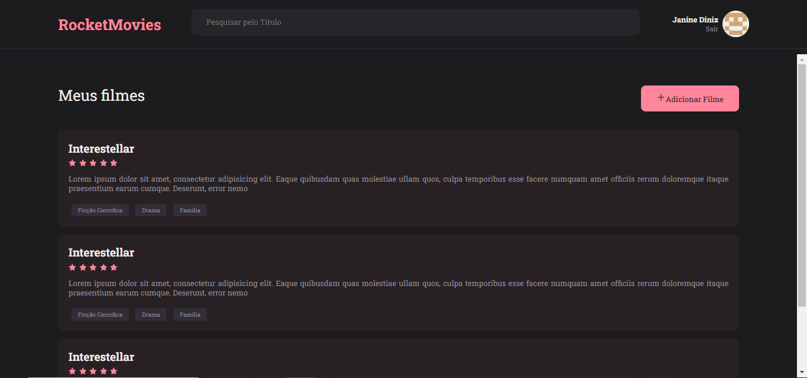

<h1 align="center"> React Movies</h1>

Projeto do treinamento da Rocketseat para ensino de tecnologias WEB.

  <a href="#-tecnologias">Tecnologias</a>&nbsp;&nbsp;&nbsp;|&nbsp;&nbsp;&nbsp;
  <a href="#-projeto">Projeto</a>&nbsp;&nbsp;&nbsp;|&nbsp;&nbsp;&nbsp;
  <a href="#-layout">Layout</a>&nbsp;&nbsp;&nbsp;|&nbsp;&nbsp;&nbsp;
  <a href="#memo-licença">Licença</a>

  

## 🚀 Tecnologias

Esse projeto foi desenvolvido com as seguintes tecnologias:

- ReactJs
- Git e Github

**Para inicializar o projeto é necessário instalar o node_modules com o comando "npm install"**

## 💻 Projeto

O projeto é uma aplicação em React Js para a criação de notas e detalhes sobre filmes. Contém as seguintes páginas: Login, Cadastro, Home(listagem das notas), Perfil, Criar Nota e Detalhes da Nota 

  

Esse projeto é um estudo dos conceitos de:
- Uso de Frameworks(ReactJs)
- Uso de Components (Single Page Application)
- Styled Components
- Rotas

## 🔖 Layout

Você pode visualizar o layout do projeto através [DESSE LINK](https://www.figma.com/file/UObYagRzmvi5PY4HhmzEHM/RocketMovies/duplicate). É necessário ter conta no [Figma](https://figma.com) para acessá-lo.

## :memo: Licença